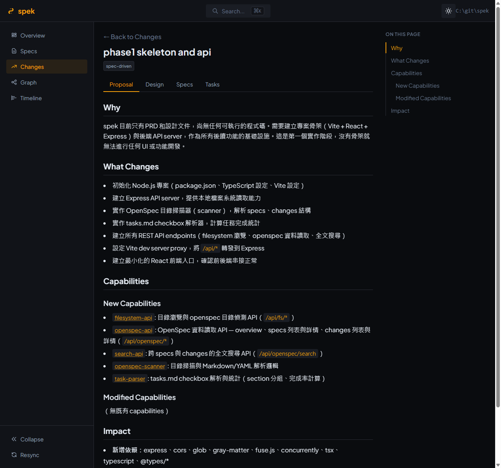

<p align="center">
  
</p>

<p align="center">
  A lightweight, read-only viewer for <a href="https://github.com/Fission-AI/OpenSpec">OpenSpec</a> content — browse specs, changes, and tasks with structure.
</p>

<p align="center">
  
  
  
</p>

**[繁體中文](README.zh-TW.md)**

---

## What is spek?

**spek** turns your local OpenSpec directory into a navigable, searchable interface. Instead of reading raw Markdown files in a text editor, spek provides structured browsing with BDD syntax highlighting, task progress tracking, and full-text search.

**[Live Demo](https://kewang.github.io/spek/demo.html)** — Try it instantly in your browser, no install needed.

Available in three forms:

- **Web** — Local Express + React app, accessible in any browser
- **VS Code Extension** — Integrated Webview Panel within your editor
- **IntelliJ Plugin** — JCEF-based Tool Window for IntelliJ IDEA and other JetBrains IDEs

All are **read-only** and **local-only**. No server deployment, no authentication, no data leaves your machine.

## Features

- **Dashboard** — Overview of specs count, changes count, task completion rates, plus lifecycle stats (avg archived lifecycle, stale active changes)
- **Specs Browser** — Alphabetical listing with detail view and revision history
- **Changes Browser** — Active and archived changes with tabbed views (Proposal / Design / Tasks / Specs); each row surfaces creation and archive dates plus lifecycle duration
- **Git Worktree Aggregation** — Discovers every git worktree of a repo and merges their in-flight changes into one view — built for the AI-agent era of parallel worktrees
- **Timeline** — Horizontal Gantt-style chart of every change's lifecycle, with optional spec-topic grouping, status filters, and an auto-scaling time axis
- **BDD Syntax Highlighting** — Visual distinction for WHEN/GIVEN, THEN, AND, MUST/SHALL keywords
- **Task Progress** — Checkbox parsing with section-grouped progress bars
- **Full-text Search** — `Cmd+K` / `Ctrl+K` to search across all specs and changes
- **Dark / Light Theme** — Toggle between themes; dark by default
- **Spec History** — Git-based timestamp tracking for spec revisions
- **Responsive Layout** — Works on various screen sizes
- **VS Code Sidebar** — Activity Bar icon with TreeView for browsing specs and changes directly from the sidebar

## Git Worktree Aggregation

In the AI-agent era, a single repository often has **several git worktrees in flight at once** — each agent, or each parallel task, working on its own branch in its own worktree. The OpenSpec changes for that work scatter across those worktrees, and pointing a viewer at any one directory shows only a fraction of what's happening.

spek discovers every worktree of a repository (via `git worktree list`) and **aggregates their in-flight changes into one view**. Point spek at any worktree — or the main repo — and you see the whole picture:

- **Active changes from every worktree**, each tagged with its source branch
- **Archived changes** merged and deduplicated across worktrees
- An **aggregation toggle** (auto-on when multiple worktrees exist); main-worktree changes stay unlabelled so feature-worktree work stands out
- Works in the **Web app** and the **VS Code extension** (panel + sidebar), with live refresh when any worktree's `openspec/` changes


## Quick Start

### Web Version

```bash
git clone https://github.com/kewang/spek.git
cd spek
npm install
npm run dev
```

Open http://localhost:5173, enter a path to a repo containing an `openspec/` directory, and start browsing.

> `npm install` compiles the shared `@spek/core` package, and `npm run dev` rebuilds it before launching — so a fresh clone starts with no extra build step.

### VS Code Extension

Install from the [Visual Studio Marketplace](https://marketplace.visualstudio.com/items?itemName=kewang.spek-vscode). The extension activates automatically when your workspace contains `openspec/config.yaml`.

Once activated, click the **spek icon** in the Activity Bar to browse specs and changes from the sidebar. Click any item to open the full viewer panel.

**Commands:**
- `spek: Open spek` — Open the viewer panel
- `spek: Search OpenSpec` — Open search dialog
- `spek: Open Dashboard` — Open the dashboard from sidebar

### IntelliJ Plugin

Install from the [JetBrains Marketplace](https://plugins.jetbrains.com/plugin/30600-spek--openspec-viewer) — search for **"spek"** in **Settings > Plugins > Marketplace**.

The plugin activates automatically when your project contains an `openspec/` directory. Click the **spek** icon in the right sidebar to open the viewer.

**Action:**
- **Tools > Open spek** — Open the viewer panel

## Screenshots

### Dashboard
Overview of specs count, changes count, and task completion rates.


### Specs Browser
Alphabetical listing of all spec topics with filter support.


### Spec Detail with BDD Highlighting
Visual distinction for BDD keywords — WHEN/GIVEN (blue), THEN (green), AND (gray), MUST/SHALL (red).


### Changes Browser
Active and archived changes listed chronologically, with lifecycle duration on every row.


### Timeline
Horizontal Gantt-style view of every change's lifecycle — active bars extend to today, archived ones render as fixed segments.


### Change Detail
Tabbed view with Proposal, Design, Tasks, and Specs sections.



### Full-text Search
`Cmd+K` / `Ctrl+K` to search across all specs and changes.


## GitHub Action

[](https://github.com/marketplace/actions/spek-openspec-static-site)

Use spek as a GitHub Action to automatically build a static OpenSpec site in your CI pipeline.

### Basic Usage

```yaml
- uses: actions/checkout@v7
  with:
    fetch-depth: 0  # Recommended for accurate change timestamps

- uses: kewang/spek@v1
  with:
    title: "My Project - OpenSpec"
```

### Deploy to GitHub Pages

```yaml
name: Build OpenSpec Site
on:
  push:
    branches: [main]
    paths: ["openspec/**"]

permissions:
  pages: write
  id-token: write

jobs:
  build-and-deploy:
    runs-on: ubuntu-latest
    environment:
      name: github-pages
      url: ${{ steps.deploy.outputs.page_url }}
    steps:
      - uses: actions/checkout@v7
        with:
          fetch-depth: 0

      - uses: kewang/spek@v1
        with:
          title: "My Project - OpenSpec"

      - uses: actions/upload-pages-artifact@v5
        with:
          path: spek-output

      - name: Deploy to GitHub Pages
        id: deploy
        uses: actions/deploy-pages@v5
```

### Inputs

| Input | Description | Default |
|-------|-------------|---------|
| `repo-path` | Path to the repo containing `openspec/` | `.` |
| `output-path` | Output HTML file path | `spek-output/spek.html` |
| `title` | Page title | `OpenSpec Viewer` |
| `spek-version` | spek version (tag, branch, or SHA) | `master` |
| `generate-badges` | Generate SVG badge files | `false` |

### Outputs

| Output | Description |
|--------|-------------|
| `html-path` | Absolute path to the generated HTML file |
| `badges-path` | Absolute path to the generated badges directory |

### Badges

Enable `generate-badges` to generate SVG status badges (specs count, open changes, tasks progress) alongside your static site. Deploy them to GitHub Pages and reference in your README:

```yaml
- uses: kewang/spek@v1
  with:
    title: "My Project - OpenSpec"
    generate-badges: true
```

Then in your README:

```markdown


```

> **Note:** Use `fetch-depth: 0` in your checkout step for accurate change timestamps. Without full git history, timestamps will be unavailable (the build still succeeds).

## OpenSpec Directory Structure

spek expects the following structure under your repository:

```
{repo}/openspec/
├── config.yaml
├── specs/
│   └── {topic}/
│       └── spec.md              # BDD-formatted specification
└── changes/
    ├── {active-change}/         # In-progress changes
    │   ├── .openspec.yaml
    │   ├── proposal.md
    │   ├── design.md
    │   ├── tasks.md
    │   └── specs/               # Delta specs for this change
    └── archive/
        └── {YYYY-MM-DD-desc}/   # Archived changes (same structure)
```

## Architecture

### Monorepo Structure

```
packages/
├── core/       # @spek/core — Pure logic (scanner, parser, types)
├── web/        # @spek/web — Express API + React SPA
├── vscode/     # spek-vscode — VS Code Extension
└── intellij/   # spek-intellij — IntelliJ Platform Plugin (Kotlin)
```

### API Adapter Pattern

The frontend communicates through an `ApiAdapter` interface with two implementations:

- **FetchAdapter** — Web + IntelliJ version, calls REST API over HTTP (configurable base URL)
- **MessageAdapter** — VS Code version, uses `postMessage` IPC with the extension host

This allows the same React UI to run in both environments without code changes.

### Tech Stack

| Layer | Technology |
|-------|-----------|
| Core | TypeScript, Node.js |
| Frontend | React 19, Vite 6, Tailwind CSS v4, React Router v7 |
| Backend | Express 4 |
| Markdown | react-markdown, remark-gfm |
| Search | Fuse.js |
| VS Code Extension | VS Code Webview API, esbuild |
| IntelliJ Plugin | Kotlin, JCEF, IntelliJ Platform SDK |

## Development

```bash
npm install              # Install all workspace dependencies
npm run dev              # Start Vite (5173) + Express (3001)
npm run build            # Build core + web
npm run build:core       # Build @spek/core only
npm run build:webview    # Build webview assets for VS Code extension
npm run build:vscode     # Build VS Code extension
npm run build:intellij   # Build IntelliJ webview assets
npm run type-check       # TypeScript type check
```

**IntelliJ Plugin build:**
```bash
npm run build:intellij                    # Build frontend assets
cd packages/intellij && ./gradlew buildPlugin  # Build plugin ZIP
```

**Requirements:** Node.js 22+, Java 17+ (for IntelliJ plugin build)

### Live reload in containers (devcontainer / WSL)

spek watches `openspec/` and live-reloads on changes. On filesystems that don't deliver native change events — 9p / drvfs / NFS / CIFS bind mounts, as used by devcontainers and WSL — spek automatically falls back to polling so newly created files are still detected. Detection is based on the watched path's filesystem type. To override:

- `SPEK_WATCH_POLLING=on` (or `off`) — force polling on/off for all surfaces
- `CHOKIDAR_USEPOLLING=1` / `CHOKIDAR_INTERVAL=<ms>` — Web and VS Code also honor chokidar's native env vars

## Acknowledgments

This project was inspired by [龍哥（高見龍）](https://kaochenlong.com)'s articles on SDD (Spec Driven Development). Special thanks to him for his contributions to SDD and [OpenSpec](https://github.com/Fission-AI/OpenSpec).

- [SDD — Spec Driven Development](https://kaochenlong.com/sdd-spec-driven-development)
- [Spectra with OpenSpec](https://kaochenlong.com/spectra-with-openspec)

## License

MIT
