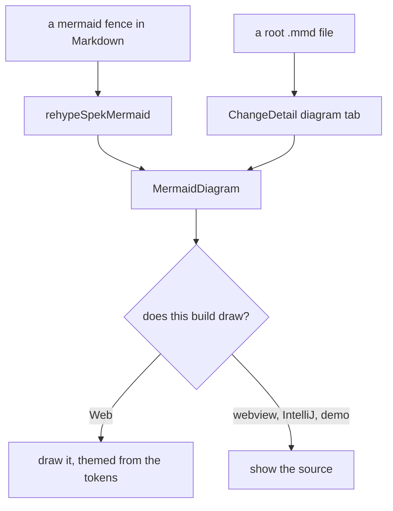
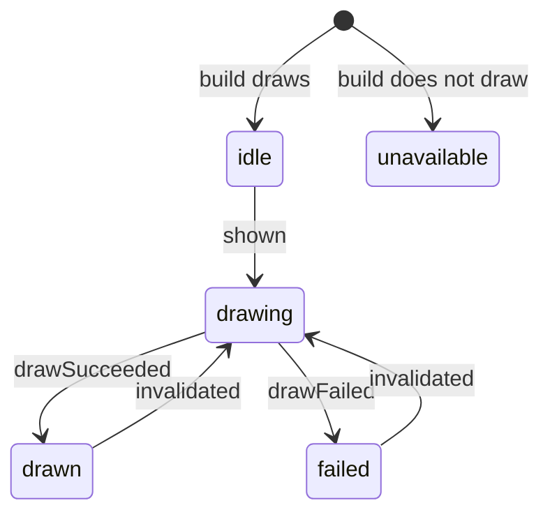

# Design

## Context

See `proposal.md` — Why. The constraints that shape the approach, all of them already in the repository:

- **Four surfaces, one SPA.** Web, VS Code webview, IntelliJ JCEF and the demo all load the same React
  app, so a renderer change reaches all four at once. Three of the four are built with
  `format: "iife"` and `manualChunks: undefined` (`vite.webview.config.ts`, `vite.intellij.config.ts`,
  `vite.demo.config.ts`), which cannot code-split: Rollup inlines a dynamic import into the single
  bundle. Only the default Web build (`vite.config.ts`) produces a real lazy chunk.
- **`docs/demo.html` is committed and already 4.5 MB**, and `demo-page` requires it to be a single
  self-contained file that issues no external request. Whatever mermaid costs, that cost lands in git.
- **Bundle size is treated as a design constraint here already.** `utils/highlight.ts` is a hand-rolled
  lowlight plugin written specifically to keep 37 unused grammars out of the three single-file bundles.
- **The VS Code CSP is `default-src 'none'`**, with `script-src 'nonce-…'`, `style-src <cspSource>
  'unsafe-inline'`, `font-src <cspSource>`, `img-src <cspSource> data:` (`packages/vscode/src/panel.ts`).
  No `unsafe-eval`, no `blob:`.
- **Specs open folded.** `spec-section-folding` renders requirements as open `
` and scenarios as
  closed ones, so content inside a spec can be in the tree and not displayed.
- **The palette check reads source.** `contrast.test.ts` parses `global.css` and scans the application's
  own source for the ways a colour reaches the screen; it cannot see markup generated at view time.
- **`@spekjs/core` is a published package**, and its artifact classification is mirrored by hand in
  Kotlin (`ArtifactFiles.kt`, `ArtifactDiscovery.kt`).

## Goals / Non-Goals

**Goals:**

- One diagram implementation serving both entry points (a `mermaid` fence and a `.mmd` artifact), so the
  two cannot drift in how they draw, theme, fail or offer source.
- Adding the root kind is a change to the one classifier, not to discovery, counting, watching and three
  search implementations separately.
- The cost of mermaid is known and stated per surface, before it is committed to `docs/`.

**Non-Goals:**

- Editing or authoring diagrams. spek is read-only.
- Diagram support in `@spekjs/ui`. That package's colour contract is nine `--spek-*` variables, and a host
  does not inherit a new contract member — a themed diagram needs far more than nine. The component is an
  application component in `packages/web/src/components/`, using the app's `--color-*` tokens directly.
- Rendering diagram *languages* other than Mermaid (PlantUML, Graphviz).
- A Kotlin diagram renderer. IntelliJ loads the same SPA; Kotlin only mirrors the file classification.

## Decisions

The shape the decisions below arrive at, since several of them only make sense against it:

(No ` ` in these labels: `securityLevel: "strict"` sanitises the tag away and joins the words
either side of it — which is itself worth knowing, and is the sort of thing this change now lets a
reader discover by looking.)

### D1. Delegation happens in a rehype plugin that runs before the highlighter, not in the `code` component

`MarkdownRenderer`'s `code` component cannot do this cleanly: the `pre` component still wraps whatever
`code` returns, so a diagram would be drawn inside a bordered, monospaced code block. A `rehypeSpekMermaid`
plugin instead rewrites `pre > code.language-mermaid` into a single element the component map renders as
the diagram, so the `<pre>` is gone before React sees it.

It is placed **first** in `rehypePlugins`, ahead of `rehypeHighlightNarrow`. The highlighter then never
sees a mermaid block, which is both the cheap order and the honest one — the file already documents that
plugin order is load-bearing, and this is one more entry in that list. It runs before
`rehypeSpekHeadingIds` too, but cannot affect it: it touches no headings and removes no heading, so the
dedup counter's traversal order is unchanged.

*Alternatives:* a remark (mdast) plugin — rejected, the block is a `code` node there and the surrounding
`<pre>` is added later by `mdast-util-to-hast`, so the same problem arrives one stage further on.
Detecting in `pre` by inspecting its child — rejected, it makes the `pre` component responsible for
knowing about diagrams, and `pre`'s child inspection is exactly the kind of structural guesswork the
`code` component's existing comment warns about.

### D2. Only the Web build draws; the other three exclude Mermaid outright

Measured, not estimated. `import("mermaid")` in the default ESM build produces exactly what was wanted:
the app entry stays 689 KB and Mermaid lands in lazy chunks (`mermaid.core` 645 KB, plus one per diagram
type), none of which a repository without diagrams ever fetches.

In the three IIFE builds the same import is **inlined**, because `format: "iife"` with
`manualChunks: undefined` cannot split:

| bundle | without Mermaid | with Mermaid inlined |
|---|---|---|
| VS Code webview | 718,653 B | 5,952,548 B |
| IntelliJ webview | same | same |
| `docs/demo.html` | 4,695,310 B | ≈ 9.9 MB |

5.23 MB per single-file surface, on a file that is committed to the repository on every release. Trimming
helps but not enough and not cleanly — the four heavyweights (`elk` 1.47 MB, `cynefin` 0.70, `cytoscape`
0.44, `katex` 0.26) are 2.87 MB of it, and cutting further means deciding which diagram types a VS Code
reader is allowed to see.

So those three surfaces do not draw at all. They show the diagram's source, which is what they show
today, stated as a capability the build does or does not have rather than as a failure. **This is a
product decision, not a technical one**, and it was taken deliberately over the alternatives above.

Two mechanisms, doing two different jobs:

- **`define: { __SPEK_DRAWS_DIAGRAMS__ }`** decides what the reader sees. The diagram view starts in a
  terminal `unavailable` state, shows the source calmly, and offers no switch to a drawing that does not
  exist. Reporting a load failure instead would tell the reader something is broken when what they are
  looking at is the file.
- **`resolve.alias: { mermaid: … }`** decides whether the bytes exist. Trusting tree-shaking to follow a
  flag through a dynamic import is a hope; an alias to a `export default null` stand-in is a fact.
  Measured: 718,653 → 719,158 B, +505.

`diagramBuilds.test.ts` asserts both across all four configs, because a bundle eight times too big fails
no type-check, no lint and no other test — it just lands in `docs/`.

*Alternative:* a CDN. Rejected outright — `demo-page` forbids it, the webview CSP forbids it, and a local
file viewer that needs the network is a different product.

### D3. Diagram theme is a declared token map, so the palette check can measure it

A module (`utils/diagramTheme.ts`) exports a pure map from mermaid `themeVariables` key to the project's
`--color-*` token name, plus the floor each entry answers to (text 4.5:1, meaning-bearing graphic 3:1,
surface). At render time the component resolves each token to its value with `getComputedStyle` on
`document.documentElement`, so it always reflects the theme actually applied, and hands mermaid
`theme: "base"` with those variables.

The point of the map is that it is **source the check can read**. `contrast.test.ts` imports it, resolves
the same tokens from `global.css` for each theme, and measures — which is what `theme-toggle`'s new
requirement asks for, and the only way to measure a palette whose markup does not exist until a reader
opens the page. Anything mermaid would otherwise supply from its own defaults is either in the map or
listed in the module as owing nothing, with the reason.

`theme: "base"` specifically: mermaid's other built-in themes ignore most `themeVariables`, so a partial
override silently leaves the library's own colours in place — which is exactly the failure the
requirement describes.

*Alternative:* hard-code two palettes, one per theme. Rejected: they are literals by another name, and
they stop tracking `global.css` the first time a token is re-authored — the `@spekjs/ui` archived-node
colour is the worked example of that already in this repository.

### D4. Rendering is deferred until the element is actually displayed

Mermaid lays a diagram out by measuring text in the DOM. Inside a closed `
`, or an unmounted tab,
every measurement is zero and the result is a collapsed, unusable diagram — and `spec-section-folding`
renders scenarios closed by default, so a diagram in a scenario would hit this on first render every time.

The component therefore renders on first intersection (`IntersectionObserver` on its container) rather than
on mount, and re-renders when the theme changes. An environment with no `IntersectionObserver` (jsdom)
falls back to rendering immediately, so tests are not written against a browser-only API.

### D5. The drawn SVG is inserted as markup, under mermaid's strict security level

`mermaid.initialize({ startOnLoad: false, securityLevel: "strict" })`, then `await mermaid.render(id,
source)` and assign the returned SVG string into the container. `securityLevel: "strict"` encodes HTML in
diagram text and disables click bindings, and mermaid sanitizes its output; `bindFunctions` is
deliberately not called, since interaction declared by the document is exactly what a read-only viewer
must not run.

The `id` comes from React's `useId()`. Mermaid derives element ids inside the SVG from it, and two
diagrams sharing one id collide in a way that shows up as the second diagram rendering with the first's
markers.

CSP: the SVG carries a `<style>` element, which `style-src 'unsafe-inline'` already permits — the same
allowance Tailwind needs. No script is injected, so `script-src 'nonce-…'` is unaffected. The one thing to
**verify rather than assume** is that mermaid's code path for the diagram types we ship uses no dynamic
code evaluation under `default-src 'none'`; the verification is a task, run in the real webview, because
`webview-integration` already records that host-only styling and policy bugs cannot reproduce in a
browser.

### D6. Pan and zoom are hand-rolled, not a dependency

A container with `overflow: hidden`, a CSS `transform: translate() scale()` on the SVG wrapper, wheel-with-
modifier and pointer-drag handlers, and explicit zoom-in / zoom-out / reset buttons. This is on the order
of a hundred lines and adds nothing to a bundle that is already the concern of D2. Buttons matter as much
as gestures: the VS Code and IntelliJ panels are narrow and often driven by keyboard, and a wheel gesture
that hijacks page scroll in a narrow panel is worse than no zoom at all — hence the modifier.

*Alternative:* `svg-pan-zoom` or `panzoom`. Rejected on the same size grounds, for behaviour we can state
exactly.

### D7. `diagram` is a new `RootKind`, not `data` with extra extensions

`data` means *show this file's text*; `diagram` means *show what this file describes*. Folding diagram
source into `data` would make `fencedBlock` + highlight the only possible rendering — the thing the file
was written to avoid. Concretely: `RootKind` gains `DIAGRAM`, `ArtifactKind` gains `"diagram"`, a
`DIAGRAM_EXTENSIONS` export joins `DATA_EXTENSIONS` so each watcher derives its set from one source, and
`buildArtifact`'s exhaustive switch gains one case. `ChangeDetail`'s tab switch gains one branch, which
`assertNever` makes a compile error until it exists.

Precedence in `rootArtifacts` puts diagram in the same bucket as data (after markdown), so a `flow.md`
keeps the id `flow` and `flow.mmd` becomes `flow-2`, matching how `spec.md`/`spec.json` already resolve.

`ChangeArtifact`'s shape is unchanged and every field stays optional, so this is **additive: minor, not
patch** for `@spekjs/core` — the same call the `data` kind made. Record it in the change's Impact for
whoever cuts the release; do not bump a version here.

### D8. Tab labelling reuses the existing collision rule

`dataTabNames` already solves "a markdown `notes` beside a data `notes.yaml`". Generalise it to cover any
kind whose title keeps an extension, rather than adding a second, parallel rule for diagrams — two rules
deciding one label is how the two surfaces end up disagreeing. The format badge reads `MERMAID` from the
existing extension-derived fallback with no new entry, but an explicit entry is added anyway so the label
is a decision rather than a coincidence.

### D9. The state machine is extracted and tested directly; the real draw is verified in a browser

The repository's web tests are `node:test` plus `renderToStaticMarkup`. There is no jsdom, and static
rendering runs no effects, so a component test can only ever observe the first state — stubbing the
Mermaid module would buy nothing, because nothing would call it.

So the behaviour that matters is extracted to where it can be driven. `utils/diagramState.ts` is the
status machine:

`unavailable` is terminal — `shown` and `invalidated` are both no-ops there, because there is nothing
to draw and nothing to redraw. A `drawSucceeded` or `drawFailed` carrying a stale generation is
dropped, so a theme toggle part-way through a draw cannot land the old SVG on top of the new one.

The source toggle rides alongside as a separate flag, so asking for the source never leaves the status
it was in. `utils/diagramZoom.ts` holds the magnification arithmetic on the same terms.

Both are pure and are tested through every transition, including the failure path and the mid-draw theme
change — neither of which a stubbed module could produce deterministically. `rehypeSpekMermaid` and the
theme table are pure too. What static rendering does assert is the state a reader meets first, which is
exactly the one that must not be a code block.

This follows the precedent already in the repository — `refreshTracker`, `foldSections` and the Kotlin
`TreeRefreshGate` are all pure logic lifted out of a component for the same reason.

That a real diagram actually draws, in both themes and at the contrast the map claims, is verified by
rendering in headless Chrome — the mechanism `spec-section-folding` already established for the fold
geometry, for the same reason: jsdom computes no layout and no colour.

## Risks / Trade-offs

- **Three of four surfaces show less than the fourth** → the accepted cost of D2, and the reason the
  source view is specified as a first-class behaviour rather than a fallback. A reader in VS Code sees
  the diagram's text, which is what they see today; nothing regresses, and `docs/demo.html` does not
  double in size in git.
- **The exclusion could regress silently** → two mechanisms and a test over the build configs. The
  failure mode is the dangerous kind: correct behaviour, 5.23 MB heavier, visible only in a file nobody
  reads before committing.
- **Mermaid is a large new dependency with its own release cadence and its own CVE surface** → it is
  loaded behind one import, used through two calls (`initialize`, `render`), and reaches one of the four
  builds; the failure path the specs require means a version that breaks on some diagram degrades to
  source-plus-reason rather than to a blank tab.
- **A diagram that draws in GitHub may fail here**, on a version difference or an unregistered type →
  this is why the specs require the reason and the source to be shown, and why the source is reachable
  from a *drawn* diagram too. The reader is never left with less than the file.
- **A drawn diagram is invisible to find-in-page**, where the source was not → the source toggle is the
  answer, and it is a stated requirement rather than a discovered limit.
- **`getComputedStyle` at render time couples drawing to the applied stylesheet** → if a token is missing
  the resolved value is empty; the theme map supplies a per-entry fallback and the check fails on a map
  entry naming a token `global.css` does not define.
- **Re-rendering every diagram on a theme toggle costs work on a diagram-heavy page** → rendering is
  already deferred to visibility (D4), so only diagrams a reader has actually looked at redraw.
- **Kotlin and TypeScript classification can drift**, as they have before → the new kind lands in both
  mirrors in the same change, and `ArtifactFiles.kt`'s `when` is exhaustive over the enum, so the Kotlin
  side fails to compile until the case exists.

## Migration Plan

Additive throughout; no data migration and no persisted state. A repository with no mermaid content
behaves exactly as before, and on Web it does not even fetch the new chunk. Rollback is reverting the
change: no artifact on disk was rewritten, and `@spekjs/core`'s new export is additive, so a consumer
pinned to the previous version is unaffected.
